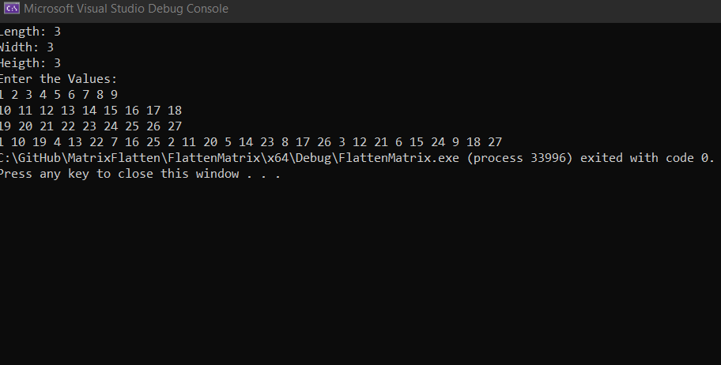
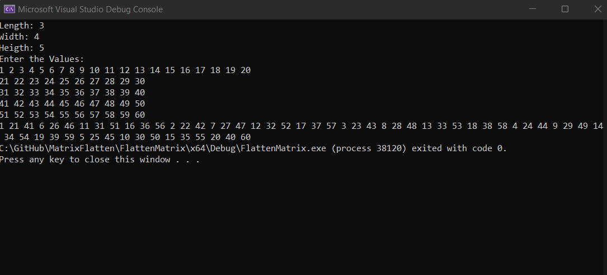
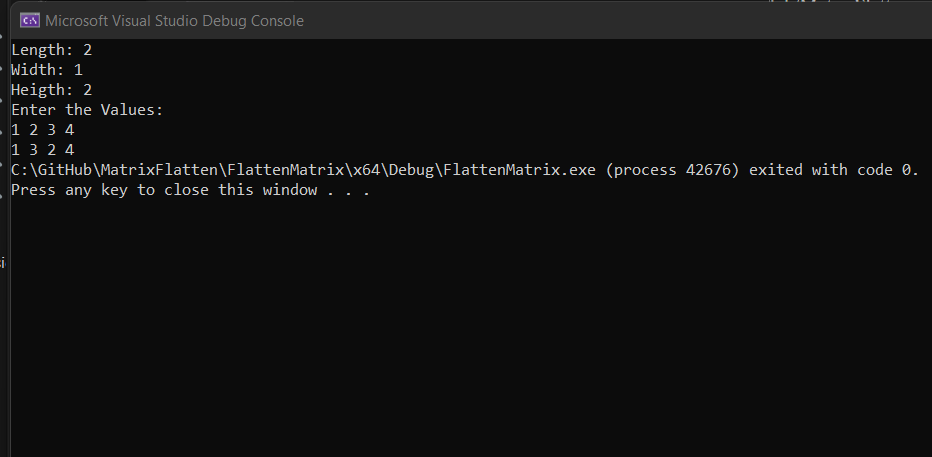

# Matrix Flatten

## About
* This program converts a 3D matrix to a flattened
## 📝 Description
* Convert the 3D matrix index (i, j, k) to a suitable 1D vector index (y). Must be O(1).

## 🏁 Getting Started

## Complexity

- The complexity of indexing from i, j, k to y is **O(1)**
- The indexing formula for the conversion from 3D element position to 1D is y =i * n(j + m*k)
- The complexity of looping through the 3D vector is **O(n\*m\*p)** 

## Dependencies

* C++

## 💻 Installing

```
git clone https://github.com/abdelazizSalah/MatrixFlatten
```

### 📷 Screenshots

#### Length = Width = Height = 3


#### Length = 3, Width = 4, Height = 5


#### Length = Height = 2, width = 1


